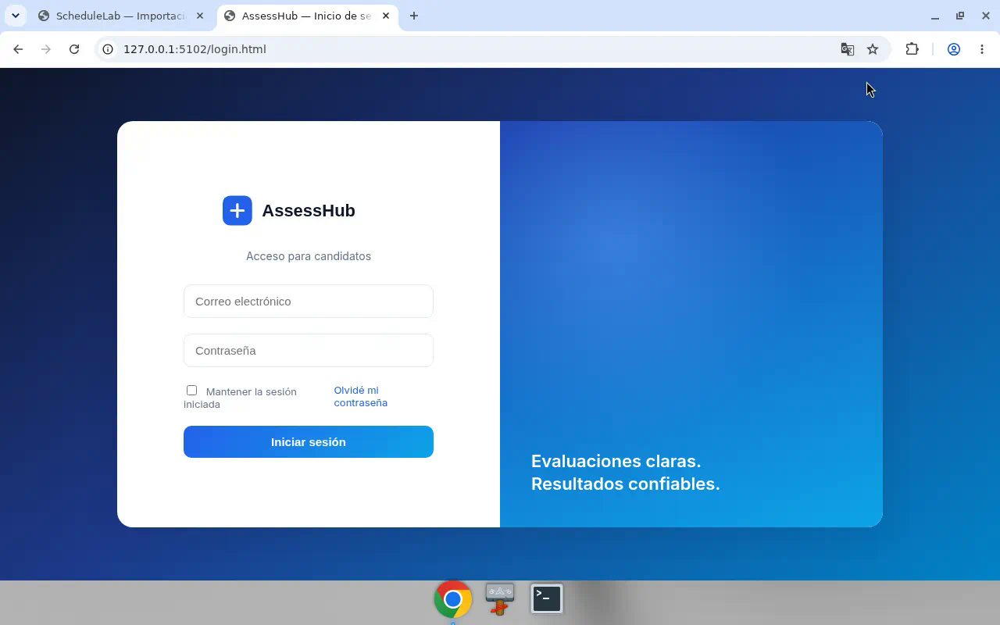
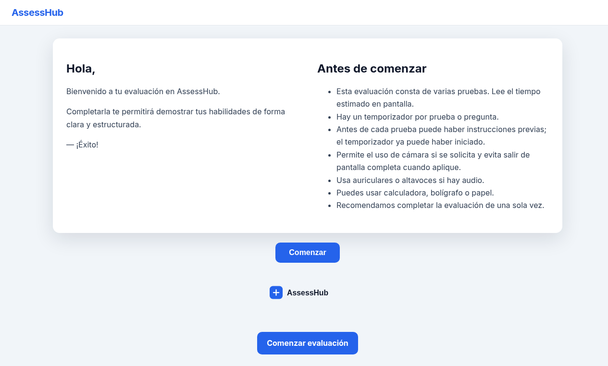

# AssessHub

Plataforma de evaluación / examen de candidatos (ASP.NET Web Forms).

<!-- screenshots -->
## Vista






## Qué hace

- **Candidatos:** login, instrucciones, preguntas (texto o imagen) y temporizador
- **Supervisores:** panel (`Default.aspx`) con candidatos y resultados desde SQL Server
- Auth Forms y master pages para login / área principal

## Stack

- ASP.NET Web Forms (.NET Framework 4.7.2)
- SQL Server (cadena `AssessHubDB` en `CheckIT/Web.config`)
- Bootstrap / jQuery
- HTML/CSS en `CheckIT/Candidato/` para la UI de evaluación

## Cómo abrir

1. Abrir `CheckIT.sln` en Visual Studio (2019/2022) con workload ASP.NET.
2. Editar `CheckIT/Web.config`: cadena `AssessHubDB` con tu servidor/usuario. Credenciales no incluidas.
3. Restaurar NuGet si hace falta.
4. Proyecto de inicio: `CheckIT` → IIS Express (F5).

Páginas útiles:

- Supervisor / login: `CheckIT/login.aspx`, `CheckIT/Default.aspx`
- Prototipos candidato: `CheckIT/Candidato/login.html`, `instrucciones.html`, `evaluacion-txt.html`

## Estructura

```
CheckIT.sln
CheckIT/
  Web.config          # AssessHubDB (placeholders)
  Default.aspx        # lista candidatos
  login.aspx
  Site.master / principal.master / secundaria.master
  Candidato/          # UI HTML
  css/styles.css
  Content/Site.css
```

## Licencia

Uso libre para adaptar y desplegar bajo tu responsabilidad.
